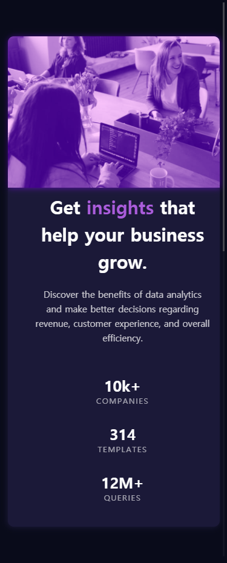

# Frontend Mentor - Stats preview card component

## Table of contents

- [Overview](#overview)
  - [The challenge](#the-challenge)
  - [Screenshot](#screenshot)
  - [Links](#links)
- [My process](#my-process)
  - [Built with](#built-with)

## Overview

### The challenge

Users should be able to:

- View the optimal layout depending on their device's screen size

### Screenshot

### Links

- Solution URL: [Add solution URL here](https://github.com/HyoJuns/frontend-mentor-stats-preview-card-component)
- Live Site URL: [Add live site URL here](https://hyojuns.github.io/frontend-mentor-stats-preview-card-component/)

## My process

### Built with

- Semantic HTML5 markup
- CSS custom properties
- Flexbox
- SASS
